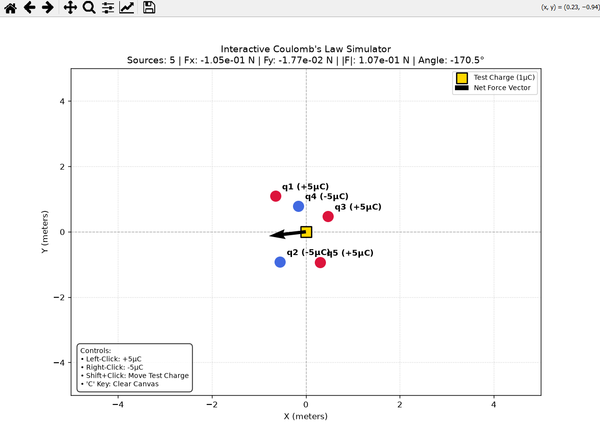

# Interactive 2D Coulomb's Law Simulator

An interactive vector-accurate physics simulation tool written in Python that calculates and renders electrostatic forces in a 2D plane according to Coulomb's Law and the principle of superposition.

## Overview

The simulator models point charges on a Cartesian coordinate plane. Users can interactively place positive or negative source charges and observe the net resultant electrostatic force vector applied to a designated test charge in real time.

## Key Features

- **Real-Time Vector Calculation:** Resolves vector components ($F_x$, $F_y$), total magnitude ($\vert{}F\vert{}$), and directional angle ($\theta$).
- **Interactive GUI:** Dynamic canvas interaction built on `matplotlib` event handlers without heavy third-party UI frameworks.
- **Visual Feedback:** Color-coded charge polarities (positive in red, negative in blue) and scaled directional force arrows.

## Controls

| Action | Control |
| :--- | :--- |
| **Add Positive Charge (+5 µC)** | Left-Click on canvas |
| **Add Negative Charge (-5 µC)** | Right-Click on canvas |
| **Move Test Charge (+1 µC)** | Shift + Left-Click (or Middle-Click) |
| **Clear All Source Charges** | Press `C` on your keyboard |

## Demo Preview

  

